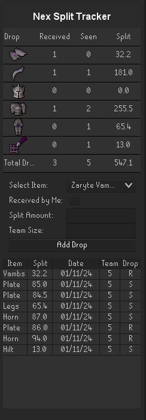

# Nex Split Tracker Plugin for RuneLite

## Overview

The Nex Split Tracker is a RuneLite plugin designed for players to efficiently track and manage loot splits from the Nex. The plugin provides an easy-to-use interface for recording drops, splits, and team sizes.

## Features

Log every drop received from Nex, including the item, split amount, and team size.
View real-time statistics for each unique drop, including the number of times seen, received, and total split value.
Secondary Table View: A detailed view for each logged drop, including the date, team size, and split amount.
Save and load your drop data between RuneLite sessions.

## Usage

#### Main Interface

Add Drop: To add a new drop, select the item from the dropdown, enter the split amount in millions and team size, and check the 'Received by Me' box if you received the item in your name. Click 'Add Drop' to log it.

Primary Table displays and calculate an overview of all unique drops, including received count, seen count, and total split.

Secondary Table shows detailed information for each logged drop. Right-click to delete an entry, this action updates the primary table automatically.

## Support
For support, questions, or feature requests, please visit [GitHub Issues](https://github.com/KeyboardIsMagic/NexSplitTracker/issues) for the Nex Split Tracker repository.For major changes, please open an issue first to discuss what you would like to change.
