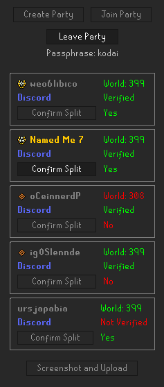
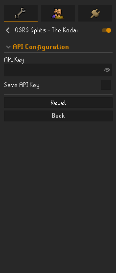

# OSRS Splits - The Kodai

A custom RuneLite plugin that helps you manage parties, display player verification, and capture in-game screenshots—enhancing trust and transparency within the **[OSRS Splits](https://discord.gg/osrssplits)**
 and **RuneWatch** communities.

---

## Overview

This plugin is designed for the **OSRS Splits** community, in accordance with **RuneWatch**, to enhance safety and trust when forming parties to kill Nex and splitting the loot. Party members can create and join parties similarly to the Party Panel plugin, while confirmation of loot splits is tracked within the plugin. With a single button click, this data is sent for verification on our community Discord servers.

When a unique drop from Nex is received, the plugin automatically takes a screenshot and uploads it—along with relevant party information—to our Discord. Verified party members are **tracked permanently**, even if they change their names multiple times, ensuring there’s no way to evade accountability or RuneWatch listings if splitting rules are broken. This promotes trust among verified members, providing a safer environment for everyone involved.

---

## Using the plugin

### Creating a Party
1. Click **Create Party** in the plugin panel.  
2. Enter a **passphrase**   
3. Your party is created locally and, if configured, also updates any verification server.

### Joining a Party
1. Click **Join Party** in the plugin panel.  
2. Enter the **passphrase** provided by the party leader.  

### Confirming Splits & Screenshots
1. **Confirm Split**: Under your username in the party list, toggle **Confirm Split**. Once toggled, it shows “Yes,” indicating you’ve agreed to split loot.  
2. **Screenshot** (Manual): When all members confirm and are on the same world, the leader’s **Screenshot and Upload** button becomes active. This captures the RuneLite client (including the plugin UI) and uploads it (if configured).  
3. **Auto-Screenshots**: The plugin is set to detect unique drops at Nex, it will automatically capture and upload a screenshot whenever a party member receives a unique drop.

---

## FAQ / Troubleshooting

- **Why isn’t my rank icon showing up?**  
  Ensure you’ve entered a valid API key. If the verification server is offline or you don’t have a rank, you’ll appear unverified. Check Discord for updates. https://discord.gg/osrssplits
- **I can’t see my party members.**  
  Double-check the passphrase and confirm everyone is on the same world.
- **No screenshot posted to Discord.**  
  Check Discord for status updates.
- **How do I confirm a split?**  
  In the party list, find your username and click **Confirm Split**. When toggled on, you’ll see “Yes” or it’ll appear in green.

---
## Support

For support, questions, or feature requests, please visit GitHub Issues for the plugin repository. For major changes, please open an issue first to discuss what you would like to change.
